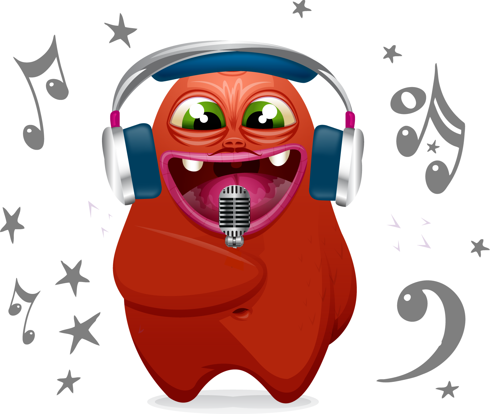

# [TasteMusic](https://github.com/tastejs/TasteMusic/issues/1)

> Empowering your MDD (Music Driven Development)

Music recommendations by JavaScripters. Because, reasons :)

[Suggest a playlist, album or track](https://github.com/tastejs/TasteMusic/issues/1) by commenting on the thread.

## License

To the extent possible under law, the [TasteJS monster](http://tastejs.com) has waived all copyright and related or neighboring rights to this work. This work is published from a galaxy far far away.
